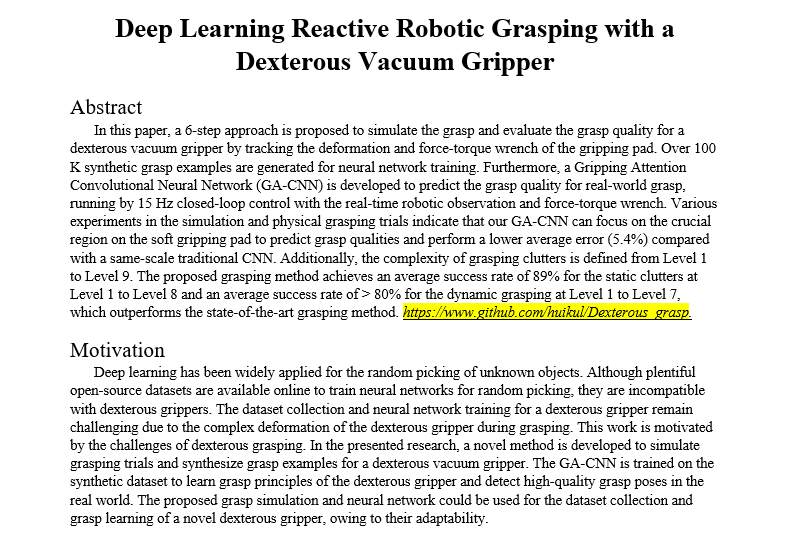

# Introduction
## Abstract




## Extra explanation
1) This repository is develoed based on the Dex-Net (https://github.com/BerkeleyAutomation/dex-net). Many source files have been revised.
2) This repository has been tested on Ubuntu 16.0 (python 3.6) and Ubuntu 20.0 (python 3.8), and the following tutorial in based on Ubuntu 20.0 (python 3.8).

++++++++++++++++++++++++++++++++
# Video demo

+++++++++++++++++++++++++++++++++++++


# Tutorials
## Install and configuration
1. Create a virtual environment: `virtualenv -p /usr/bin/python3.8 venv_3.8`
2. Activate the virtual environment: `source ~/venv_3.8/bin/activate`
3. Clone this repository:
    ```bash
    cd $HOME/
    git clone https://github.com/huikul/Dexterhuous_grasp.git
    ```
4. Install all requirements in `requirement.txt`    
    ```bash
    cd $HOME/Dexterous_grasp
    pip install -r requirements.txt
    ```

5. Install the revised meshpy (based on [Berkeley Automation Lab: meshpy](https://github.com/BerkeleyAutomation/meshpy))
    ```bash
    cd $HOME/Dexterous_grasp/meshpy
    python setup.py develop
    ```
    
6. Install the SDFGen from [GitHub](https://github.com/jeffmahler/SDFGen.git):
    ```bash
    git clone https://github.com/jeffmahler/SDFGen.git
    cd SDFGen
    mkdir build
    cd build
    cmake ..
    make
    ```  
    
7. Install the python-pcl package:
    For Ubuntu 16, the python-pcl package can be installed by the command ```pip install python-pcl``` or  by the source package (refer the tutorial in the repository [PointNetGPD](https://github.com/BerkeleyAutomation/meshpy)) under virtual Python environment. However, ```pip install python-pcl``` is not available for Ubuntu 20.0, and the source package can not be compiled successfully on every PC with Ubuntu 20.0. If you are failed to install the python-pcl in your virtual environment, here we provide another method:
    ```
    sudo add-apt-repository ppa:sweptlaser/python3-pcl
    sudo apt update
    sudo apt install python3-pcl
    ```
    Then copy the python-pcl package to your virtual environment, for example:
    ```
    copy the folder from /usr/lib/python3/dist-packages/pcl to the path $HOME/venv_3.8/lib/python3.8/site-packages/pcl
    ```
    Note: this method cannot make sure all pcl functions run well in the virtual environment (e.g.: pcl visualization), but we can make sure the functions used in our repository can be used.
    
8. Install the grasp simulator:   
    ```bash
    cd $HOME/Dexterous_grasp/vst_sim
    python setup.py develop
    ```

## Simulation and visualization
   Our grasp simulation is implemented with a virtual dexterous gripper and a set of high-resolution 3D meshes of objects from [YCB benchmarks](https://www.ycbbenchmarks.com/). To generate a large-scale dataset, please download the 3D meshes via the [link](http://ycb-benchmarks.s3-website-us-east-1.amazonaws.com/)
   
   Here, we provide a brief exmaple of the grasp simulatio based on a 3D mesh from the YCB bencmarks:

1. Dowload the 3D mesh [here](https://drive.google.com/file/d/1_GWzLP1bYUe6Ersm9kmDv4I3cEJIqTh-/view?usp=sharing) and unzip the files to the folder ```$HOME/Dexterous_grasp/3D_meshes```, as shown in the figure below:
   
    
2. 


## Train a neural network


# Citation

about PCL

about extra packages

about gripper size   scale_size


sudo apt install python3-pcl
sudo apt-get install pcl-tools
copy /usr/lib/python3/dist-packages/pcl  to  /home/acro/venv_3.8/lib/python3.8/site-packages/pcl

3D meshes: https://drive.google.com/file/d/1_GWzLP1bYUe6Ersm9kmDv4I3cEJIqTh-/view?usp=sharing 


training dataset: 
https://drive.google.com/file/d/1fJBxswzjU5H4lqjVxG3UMEkH3Qm9gaUu/view?usp=sharing


back link: https://pan.baidu.com/s/1TE0AiBnN_gUpVO2zjXhiCA
Extract code: abcd


