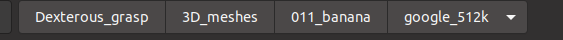

# Introduction
### **Please don't spread this repository online before our paper is published.**

## Abstract


## Extra explanation
1) This repository is developed based on the [Dex-Net](https://github.com/BerkeleyAutomation/dex-net). Many source files have been revised.
2) This repository has been tested on Ubuntu 16.0 (python 3.6) and Ubuntu 20.0 (python 3.8), and the following tutorial is based on Ubuntu 20.0 (python 3.8).
3) **Please don't spread this repository online before our paper is published.**

# Video demo
1. https://youtu.be/LSdygY7ReJ8
2. https://1drv.ms/v/s!Aok6lAYtb5vYzHm7LP-IX6gxdw68?e=Tv4Ykk

# Tutorials
## Install and configuration
1. Create a virtual environment: `virtualenv -p /usr/bin/python3.8 venv_3.8`
2. Activate the virtual environment: `source ~/venv_3.8/bin/activate`
3. Clone this repository:
    ```bash
    cd $HOME/
    git clone https://github.com/huikul/Dexterhuous_grasp.git
    ```
4. Install all requirements in `requirement.txt`    
    ```bash
    cd $HOME/Dexterous_grasp
    pip install -r requirements.txt
    ```

5. Install the revised meshpy (based on [Berkeley Automation Lab: meshpy](https://github.com/BerkeleyAutomation/meshpy))
    ```bash
    cd $HOME/Dexterous_grasp/meshpy
    python setup.py develop
    ```
    
6. Install the SDFGen from [GitHub](https://github.com/jeffmahler/SDFGen.git):
    ```bash
    cd $HOME/Dexterous_grasp
    git clone https://github.com/jeffmahler/SDFGen.git
    cd SDFGen
    mkdir build
    cd build
    cmake ..
    make
    ```  
    
7. Install the python-pcl package:
    For Ubuntu 16, the python-pcl package can be installed by the command ```pip install python-pcl``` or  by the source package (refer to the tutorial in the repository [PointNetGPD](https://github.com/BerkeleyAutomation/meshpy)) under virtual Python environment. However, ```pip install python-pcl``` is not available for Ubuntu 20.0, and the source package can not be compiled successfully on every PC with Ubuntu 20.0. If you are failed to install the python-pcl in your virtual environment, here we provide another method:
    ```
    sudo add-apt-repository ppa:sweptlaser/python3-pcl
    sudo apt update
    sudo apt install python3-pcl
    ```
    Then copy the python-pcl package to your virtual environment, for example: copy the folder from ```/usr/lib/python3/dist-packages/pcl``` to the path ```$HOME/venv_3.8/lib/python3.8/site-packages/pcl```

    Note: This method cannot make sure all PCL functions run well in the virtual environment (e.g.: PCL visualization), but we can make sure the functions used in our repository are OK.
    
8. Install the grasp simulator:   
    ```bash
    cd $HOME/Dexterous_grasp/vst_sim
    python setup.py develop
    ```

## Simulation and visualization
   Our grasp simulation is implemented with a virtual dexterous gripper and a set of high-resolution 3D meshes of objects from [YCB benchmarks](https://www.ycbbenchmarks.com/). To generate a large-scale dataset, please download the 3D meshes via the [link](http://ycb-benchmarks.s3-website-us-east-1.amazonaws.com/)
   
   Here, we provide a brief example of the grasp simulation based on a 3D mesh from the YCB benchmarks:

1. Download the 3D mesh [here](https://drive.google.com/file/d/1_GWzLP1bYUe6Ersm9kmDv4I3cEJIqTh-/view?usp=sharing) and unzip the files to the folder ```$HOME/Dexterous_grasp/3D_meshes```, as shown in the figure below:
   
    
2. Generate `nontexture.obj` for the 3D meshes:
    ```bash
    cd $HOME/Dexterous_grasp/vst_sim/apps
    python 01_pre_process_render_obj.py
    ```

3. Generate `nontexture.sdf` ([Signed Distance Field](https://en.wikipedia.org/wiki/Signed_distance_function)) for the 3D meshes:
    ```bash
    python 02_pre_process_render_sdf.py
    ```

4. Generate `surface_normals_pcl.npy` for the 3D meshes:
    ```bash
    python 03_pre_process_calculate_obj_normals.py
    ```
    
5. Visualize a virtual grasping trial:
    ```bash
    python 04_generate-dataset-Dexterous_vacuum_vis.py
    ``` 
    The virtual grasping trial:  
      
    The real-world grasping trial with the similar object:  
      
6. Visualize a local point cloud for the grasping trial:
    ```bash
    python 05_generate-point_cloud_vis.py
    ```
    

### Extra tips for grasp simulation
1. To generate a large-scale dataset, please adjust the parameters in the file `$HOME/Dexterous_grasp/vst_sim/data/grippers/dexterous_vacuum/params.json`, and make sure the variable `scale_size=1.0`

2. Replace the Python scripts in `Step 4` and `Step 5`, and run the scripts one by one: 
    ```bash
    python 04_generate-dataset-Dexterous_vacuum.py
    python 05_generate-point_cloud.py
    ```

3. A backup [link](https://1drv.ms/u/s!Aok6lAYtb5vYzFniMQyjCUnpmy9w?e=NUjMNd) to download our 3D mesh.

## Train a neural network
1. Here we provide a brief training demo based on a mini dataset. Please download the mini dataset [here](https://drive.google.com/file/d/1fJBxswzjU5H4lqjVxG3UMEkH3Qm9gaUu/view?usp=sharing).

2. Unzip the mini dataset and copy them into the path `$HOME/Dexterous_grasp/dataset`.  
      
    
3. Launch the visualization webpage:
    ```bash
    cd $HOME/Dexterous_grasp/NeuralNetwork/data
    python -m visdom.server -port 8031 -env_path ~/Dexterous_grasp/NeuralNetwork/data
    ```
4. Open your web browser, and visit the webpage below to monitor the training progress:
    ```bash
    http://localhost:8031/
    ```

5. Start training:
    ```bash
    cd $HOME/Dexterous_grasp/NeuralNetwork/data
    python train_DexVacuum_Linr_80.py
    ```

### Extra tips for neural network training

1. A backup [link](https://1drv.ms/u/s!Aok6lAYtb5vYzFpoUwuhR24el4xr?e=deWaV1) to download our mini dataset.

# Citation
## **Will be available soon. Please don't spread this repository online before our paper is published.**
